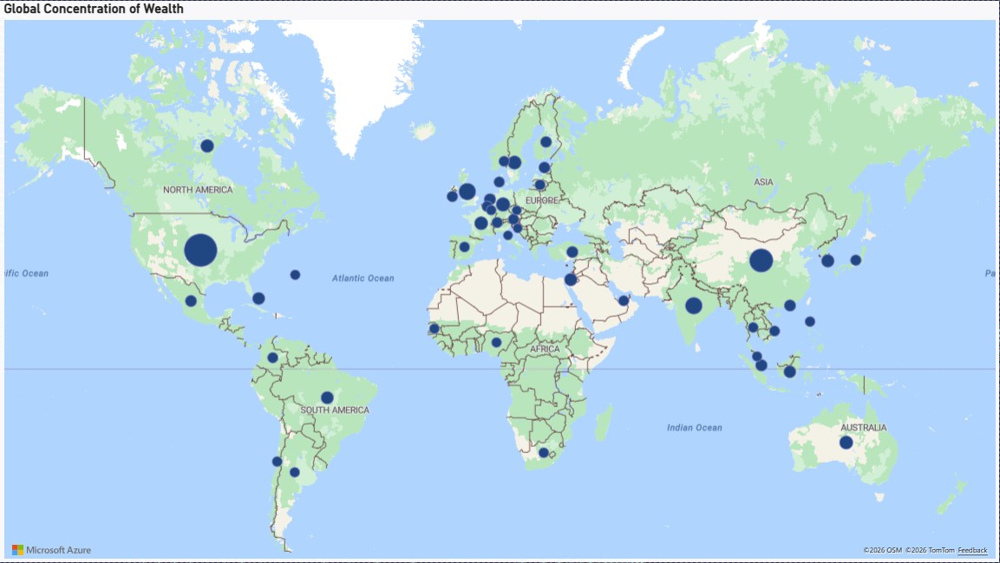
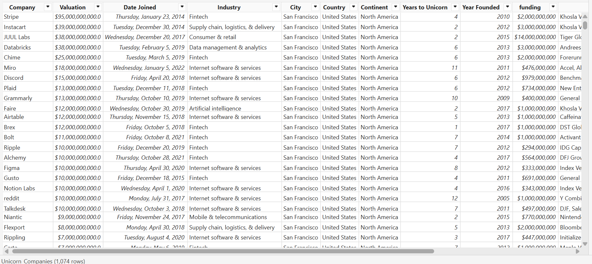
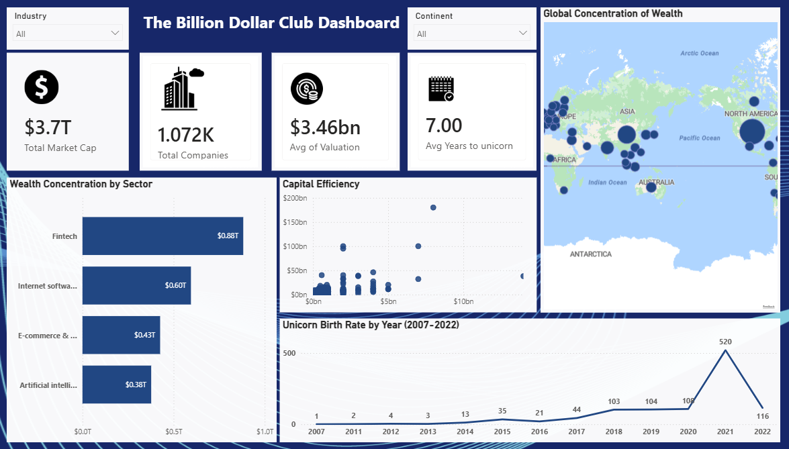

# The "Billion Dollar Club": Global Strategic Analysis of Unicorn Companies (2007–2022)

---

## Executive Summary
This project analyzes **1,072 unicorn companies** with a combined market valuation of approximately **$3.7 trillion**.

Key findings show that:
- **Fintech** leads global wealth concentration at **$0.88T**
- The average time to reach unicorn status is **7 years**
- **2021 recorded a peak of 520 new unicorns**, followed by a sharp decline in 2022 (116), indicating a market correction

---

## Business Context
Venture Capital firms require a strategic, data-driven approach to identify:
- High-growth sectors  
- Geographic investment opportunities  
- Capital-efficient companies  

This analysis provides a macro-level perspective to support smarter investment decisions across industries and regions.

---

## Objectives
This dashboard answers the following strategic questions:

- What is the total market size and average valuation of unicorn companies?
- Are we in a startup growth phase or market correction cycle?
- Which industries and regions dominate wealth creation?
- Which companies demonstrate strong capital efficiency (Funding vs Valuation)?

---

## Data Overview
- **Source:** `Unicorn_Companies.csv`
- **Companies:** 1,072
- **Timeframe:** 2007–2022
- **Key Fields:**
  - Valuation
  - Funding
  - Industry
  - Continent
  - Date Joined

---

## Key Metrics Snapshot
- **Total Market Cap:** $3.7T
- **Total Companies:** 1,072
- **Average Valuation:** $3.46B
- **Average Time to Unicorn:** 7 years
- **Peak Year:** 2021 (520 companies)

---

## Key Findings
- **Market Scale:** Unicorn companies collectively represent a $3.7T market.
- **Wealth Leader:** Fintech dominates with $0.88T, outperforming all other sectors.
- **Growth Cycle:** A massive spike occurred in 2021, followed by a decline in 2022, signaling a cooling market.
- **Geographic Concentration:** Wealth is heavily concentrated in **North America and Asia**.

---

## Data Cleaning and Transformation
Data preparation was performed using Power Query:

- **Date Parsing:**
  - Extracted Year, Month, and Day from "Date Joined" for time-series analysis

- **Text Standardization:**
  - Applied TRIM, CLEAN, and UPPERCASE transformations

- **Value Handling:**
  - Replaced null and inconsistent values in Valuation and Funding

- **Column Optimization:**
  - Removed unnecessary columns and improved dataset structure

---

## Detailed Analysis

### Startup Growth Cycle (Boom vs Bust)
- Steady growth from 2014
- Peak in 2021 with 520 unicorn births
- Sharp decline in 2022 (116), indicating market correction

### Wealth Concentration by Industry
- Fintech leads with $0.88T
- Followed by:
  - Internet Software: $0.60T
  - E-commerce: $0.43T
  - AI: $0.38T

### Capital Efficiency
- Majority of companies cluster below $50B valuation
- Few outliers achieve high valuation with relatively lower funding
- Highlights rarity of highly capital-efficient startups

---

## Dashboard Preview

---

## Recommendations
- **Sector Focus:**
  - Increase attention on **Artificial Intelligence**, which shows strong valuation potential with fewer competitors

- **Investment Strategy:**
  - Identify and avoid "cash-burning" companies with high funding but low valuation growth

- **Geographic Expansion:**
  - Explore emerging markets in **Asia and Europe** for better entry opportunities compared to saturated North America

---

## Tools Used
- Power BI Desktop: Data modeling and dashboard development
- Power Query: Data cleaning and transformation
- Power BI Service: Report publishing and sharing

---

## Skills Demonstrated
- Data Cleaning and Transformation (Power Query)
- Data Modeling and DAX Calculations
- Data Visualization (Power BI)
- Trend Analysis and Time-Series Analysis
- Business Insight Generation and Strategic Recommendation

---

## Conclusion
This project transforms raw unicorn company data into a strategic decision-making tool.

Key insights include:
- Fintech as the dominant wealth-generating sector
- 2021 as the peak of startup growth
- Emerging opportunities in AI and non-US markets

The dashboard enables investors and stakeholders to make informed, data-driven decisions in a dynamic global market.
